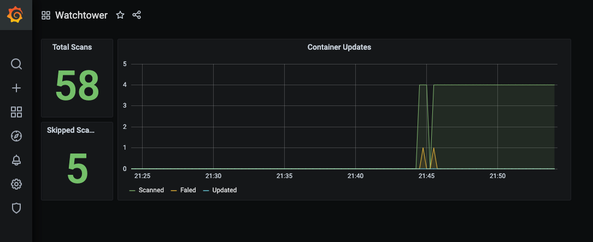

# Metrics

## Overview

The `/v1/metrics` endpoint provides Prometheus-compatible metrics.

To use this feature, set an [API token](../../../configuration/http-api/index.md#http_api_token), include `metrics` in [`http-api-endpoints`](../../../configuration/http-api/index.md#http_api_endpoints), and map container port `8080`.

!!! Note
    Enable multiple endpoints in one allowlist (for example `metrics,update`) via [`http-api-endpoints`](../../../configuration/http-api/index.md#http_api_endpoints).

!!! Warning
    Enabling the metrics API with port mappings will automatically disable Watchtower's self-update functionality to prevent port conflicts during container recreation.
    See [Updating Watchtower](../../../getting-started/updating-watchtower/index.md#port_configuration_limitation) for more details.

!!! Note
    The `/v1/metrics` endpoint only accepts `GET` requests.
    Requests with other HTTP methods will receive a `405 Method Not Allowed` response.

## Available Metrics

| Name                                         | Type    | Description                                                                        |
|----------------------------------------------|---------|------------------------------------------------------------------------------------|
| `watchtower_containers_scanned`              | Gauge   | Number of containers scanned for changes during the last scan                      |
| `watchtower_containers_updated`              | Gauge   | Number of containers updated during the last scan                                  |
| `watchtower_containers_failed`               | Gauge   | Number of containers where update failed during the last scan                      |
| `watchtower_containers_restarted_total`      | Counter | Number of containers restarted due to linked dependencies since watchtower started |
| `watchtower_containers_skipped`              | Gauge   | Number of containers skipped during the last scan                                  |
| `watchtower_scans_total`                     | Counter | Number of scans since watchtower started                                           |
| `watchtower_scans_skipped_total`             | Counter | Number of skipped scans since watchtower started                                   |
| `watchtower_docker_images_bytes`             | Gauge   | Docker image storage usage in bytes from the last disk-space check                 |
| `watchtower_docker_images_reclaimable_bytes` | Gauge   | Reclaimable Docker image storage in bytes from the last disk-space check           |
| `watchtower_disk_space_max_bytes`            | Gauge   | Configured Docker image-usage maximum in bytes (0 if unset)                        |
| `watchtower_disk_space_warn_bytes`           | Gauge   | Configured Docker image-usage warning threshold in bytes (0 if unset)              |

The four image-usage gauges are updated when [`disk-space-max`](../../../configuration/update-behavior/index.md#disk_space_max) or [`disk-space-warn`](../../../configuration/update-behavior/index.md#disk_space_warn) are set.
See [Disk Usage Monitor](../../../advanced-features/disk-usage-monitor/index.md#metrics).

## Example Prometheus `scrape_config`

```yaml
scrape_configs:
  - job_name: watchtower
    scrape_interval: 15s
    metrics_path: /v1/metrics
    bearer_token: demotoken
    static_configs:
      - targets:
        - 'watchtower:8080'
```

Replace `demotoken` with the Bearer token you have set accordingly.

## Demo

<!-- TODO: Use GitHub raw URL reference -->
The repository contains an example deployment with Prometheus and Grafana, available through `/examples/metrics/docker-compose.yml`.
This demo is preconfigured with a dashboard, which will look something like this:


